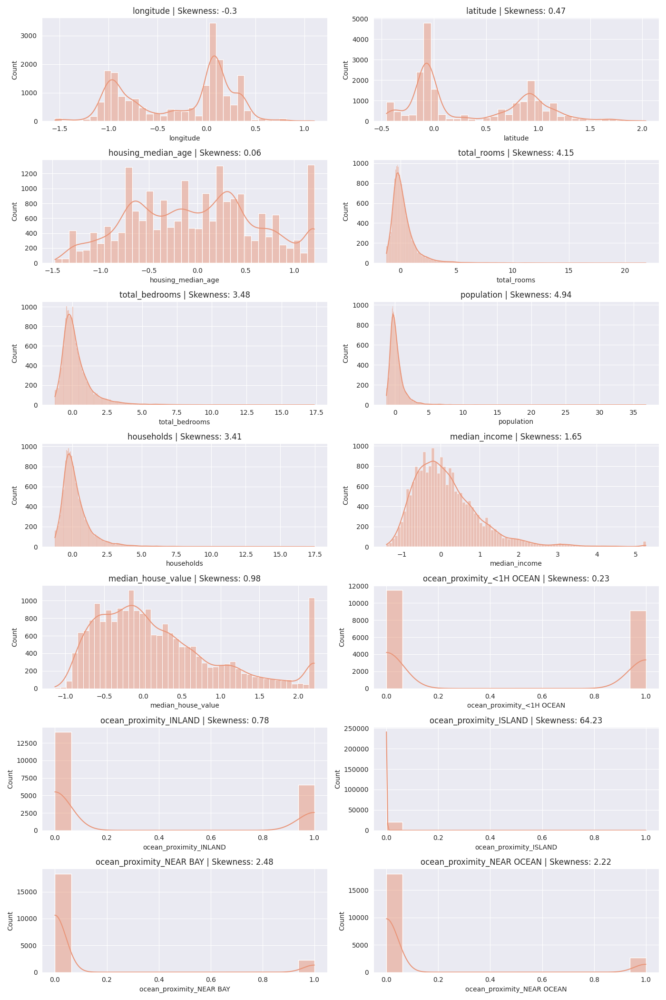
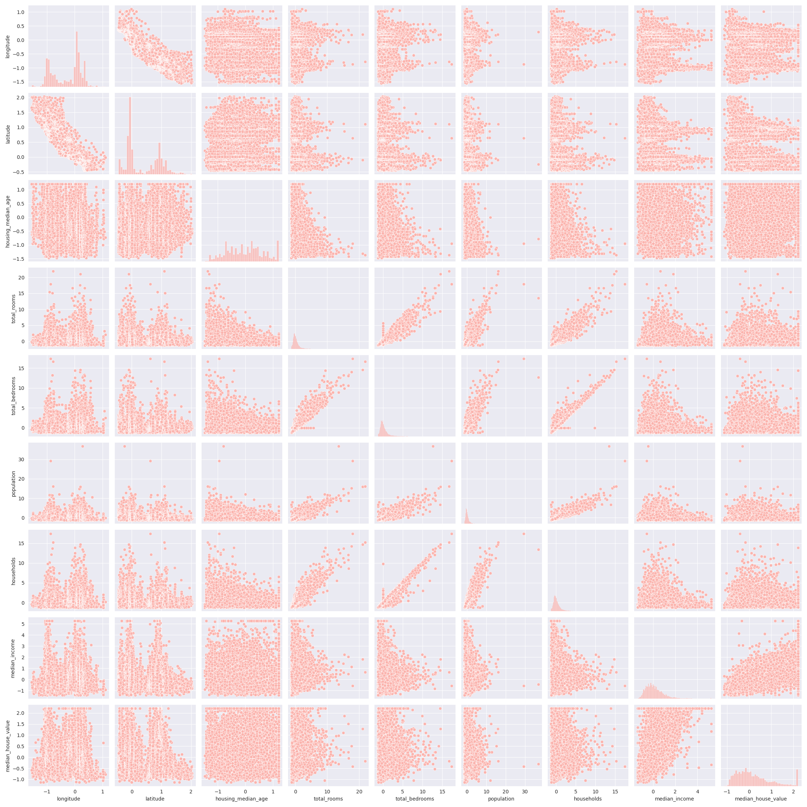
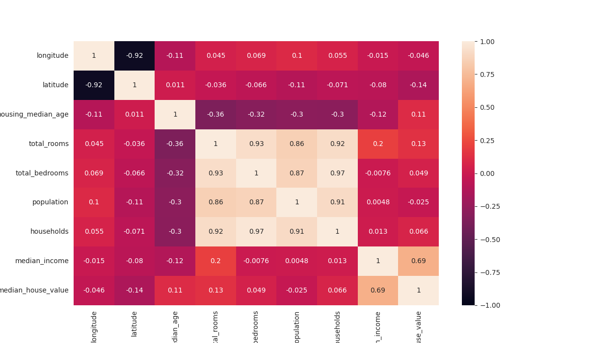

# Data Analysis Report

## 1. Dataset Overview
### Basic Information
- Total Records: 20640
- Total Features: 10
- Numeric Features: 9
- Categorical Features: 1

## 2. Data Quality Analysis
### Missing Values

| Feature | Missing Count | Missing Percentage |
| --- | --- | --- |
| total_bedrooms | 207 | 1.0

## 3. Numeric Features Analysis
### Statistical Summary

| Feature | Mean | Median | Std | Min | Max | Skew |
| --- | --- | --- | --- | --- | --- | --- |
| longitude | -119.57 | -118.49 | 2.00 | -124.35 | -114.31 | -0.30 |
| latitude | 35.63 | 34.26 | 2.14 | 32.54 | 41.95 | 0.47 |
| housing_median_age | 28.64 | 29.00 | 12.59 | 1.00 | 52.00 | 0.06 |
| total_rooms | 2635.76 | 2127.00 | 2181.62 | 2.00 | 39320.00 | 4.15 |
| total_bedrooms | 537.87 | 435.00 | 421.39 | 1.00 | 6445.00 | 3.46 |
| population | 1425.48 | 1166.00 | 1132.46 | 3.00 | 35682.00 | 4.94 |
| households | 499.54 | 409.00 | 382.33 | 1.00 | 6082.00 | 3.41 |
| median_income | 3.87 | 3.53 | 1.90 | 0.50 | 15.00 | 1.65 |
| median_house_value | 206855.82 | 179700.00 | 115395.62 | 14999.00 | 500001.00 | 0.98 |

### Outliers Analysis
Using IQR method to detect outliers:

#### longitude
- Number of outliers: 0
- Percentage of outliers: 0.00%

#### latitude
- Number of outliers: 0
- Percentage of outliers: 0.00%

#### housing_median_age
- Number of outliers: 0
- Percentage of outliers: 0.00%

#### total_rooms
- Number of outliers: 1287
- Percentage of outliers: 6.24%
- Outlier values: 7099.00, 5806.00, 5871.00, 5963.00, 12842.00

#### total_bedrooms
- Number of outliers: 1271
- Percentage of outliers: 6.16%
- Outlier values: 2477.00, 1331.00, 1270.00, 1414.00, 1603.00

#### population
- Number of outliers: 1196
- Percentage of outliers: 5.79%
- Outlier values: 3469.00, 4367.00, 4985.00, 3337.00, 3276.00

#### households
- Number of outliers: 1220
- Percentage of outliers: 5.91%
- Outlier values: 1138.00, 2323.00, 1180.00, 1250.00, 1250.00

#### median_income
- Number of outliers: 681
- Percentage of outliers: 3.30%
- Outlier values: 8.33, 8.30, 11.60, 8.20, 8.40

#### median_house_value
- Number of outliers: 1071
- Percentage of outliers: 5.19%
- Outlier values: 500001.00, 483300.00, 500001.00, 489600.00, 500001.00

## 4. Categorical Features Analysis

### ocean_proximity

| Value | Count | Percentage |
| --- | --- | --- |
| <1H OCEAN | 9136 | 44.26% |
| INLAND | 6551 | 31.74% |
| NEAR OCEAN | 2658 | 12.88% |
| NEAR BAY | 2290 | 11.09% |
| ISLAND | 5 | 0.02% |

## 5. Preprocessing Summary
### Applied Transformations
- Handled missing values
- Standardized numeric features
- Encoded categorical variables

### Dataset Transformation
- Original shape: (20640, 10)
- Processed shape: (20640, 14)

### Generated Features
| Original Feature | Generated Features |
| --- | --- |
| ocean_proximity | ocean_proximity_<1H OCEAN, ocean_proximity_INLAND, ocean_proximity_ISLAND, ocean_proximity_NEAR BAY, ocean_proximity_NEAR OCEAN |

## 6. Visualizations
### Univariate Analysis

### Bivariate Analysis

### Multivariate Analysis
